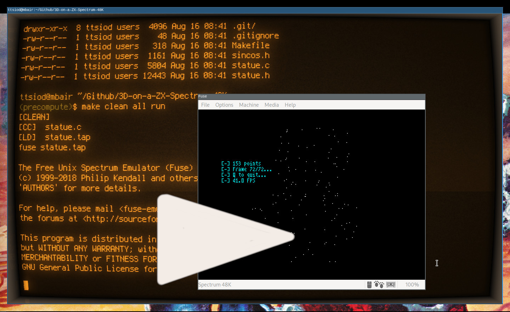
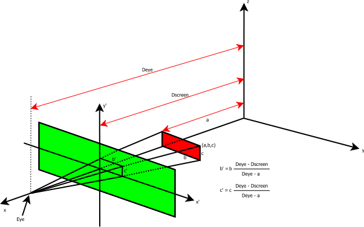

# The backstory

I've been fooling around with SW-only 3D graphics
[for quite some time](https://www.thanassis.space/renderer.html).
A couple of years ago, [I ported the main logic](https://github.com/ttsiodras/3D-on-an-ATmega328p/)
into an ATmega328P microcontroller, implementing "points-only" 3D rendering,
and driving an OLED display via the SPI interface...  at the
magnificent resolution of 128x64 :-)

# The challenge - run it on the Speccy

So the path to even more useless tinkering was clear:

**I had to make this work for my ZX Spectrum 48K! :-)**

And as you can see in this repository... I just did:

There's a simple *Makefile* driving the build process - so once
you have `z88dk` installed, just type:

    make clean all run

The resulting `statue.tap` file is also committed in the repo,
in case you just want to quickly run this in your FUSE emulator.

# Compiling z88dk

The cross-compiler used for the compilation is [z88dk](https://www.z88dk.org/forum/).
If it's not packaged in your distribution, you can easily build it from source:

    mkdir -p ~/Github/
    cd ~/Github/
    git clone https://github.com/z88dk/z88dk/
    cd z88dk
    git submodule init
    git submodule update
    ./build.sh

You can now use the cross compiler - by just setting up your enviroment (e.g. in your `.profile`):

    export PATH=$HOME/Github/z88dk/bin:$PATH
    export ZCCCFG=$HOME/Github/z88dk/lib/config

# On 3D projection and Z80 assembly

Since the Speccy's brain is even tinier than the ATmega328P's, 
I had to take even more liberties:  I changed the computation
loop to orbit the viewpoint (instead of rotating the statue),
thus leading to the simplest possible equations:

    int wxnew = points[i][0]-mcos;
    int x = 128 + ((points[i][1]+msin)/wxnew);
    int y = 96 - (points[i][2]/wxnew);

No multiplications, no shifts; just two divisions, and a 
few additions/subtractions.

But that was not the end - if one is to reminisce, one must go
**all the way**!

So after almost 4 decades, I re-wrote Z80 assembly - and
[made much better use](https://github.com/ttsiodras/3D-on-a-ZX-Spectrum-48K/blob/master/statue.c#L88)
of the Z80 registers [than any C compiler can](https://retrocomputing.stackexchange.com/questions/6095/).

The result?

Almost a 2x speedup... Reaching the phenomenal speed of 10 frames per sec :-)

# Pre-calculating for maximum speed

I was also curious about precalculating the entire paths and the
screen memory writes - you can see that code in the
[precompute](https://github.com/ttsiodras/3D-on-a-ZX-Spectrum-48K/tree/precompute)
branch.

As you can see in the video above, this version runs 4 times faster,
at 40 frames per sec. It does take a couple of minutes to precompute
everything, though. Since I had all the time in the world to precompute,
I used the complete equations
([for rotating the statue and 3D projecting](https://github.com/ttsiodras/3D-on-a-ZX-Spectrum-48K/blob/precompute/statue.c#L42))
in 8.8 fixed-point arithmetic:

The reason for the insane speed, is that I precompute the target pixels'
video RAM locations and pixel offsets, leaving almost nothing for the
[final inner loop](https://github.com/ttsiodras/3D-on-a-ZX-Spectrum-48K/blob/precompute/statue.c#L179),
except extracting the memory access coordinates from 16 bits/pixel:

- The offset within the 6K of video RAM, in the upper 13 bits
- The pixel (0-7) within that byte, in the lower 3 bits

It's also worth noting that the
[inline assembly version of the "blitter"](https://github.com/ttsiodras/3D-on-a-ZX-Spectrum-48K/blob/precompute/statue.c#L91)
is 3.5 times faster than [the C version](https://github.com/ttsiodras/3D-on-a-ZX-Spectrum-48K/blob/precompute/statue.c#L175).
Since these are just reads, shifts and writes, I confess I did not expect
to see that much of a difference... But clearly, C compilers for the Z80
[need all the help they can get](https://retrocomputing.stackexchange.com/questions/6095/) :-)

# Next step - the real thing

Now all I need to do is wait for my retirement... so I can use
my electronics knowledge to revive my Speccy, and test this code
on the real thing, not just on the Free Unix Spectrum Emulator :-)

Then again, maybe you, kind reader, can try this out
on your Speccy - and tell me if it works?

Cheers!  
Thanassis.
