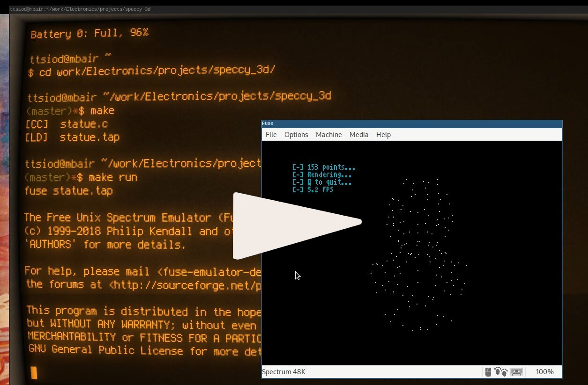

# The backstory

I've been fooling around with SW-only 3D graphics
[for quite some time](https://www.thanassis.space/renderer.html).
A couple of years ago, [I ported the main logic](https://github.com/ttsiodras/3D-on-an-ATmega328p/)
into an ATmega328P microcontroller, implementing "points-only" 3D rendering,
and driving an OLED display via the SPI interface...  at the
magnificent resolution of 128x64 :-)

So the path to even more useless tinkering was clear:

**I had to make this work for my ZX Spectrum 48K! :-)**

# The challenge

And well, I did.

Since the Speccy's brain is even tinier than the ATmega328P's, 
I had to take even more liberties:  I changed the computation
loop to orbit the viewpoint (instead of rotating the statue),
thus leading to the simplest possible equations:

    int wxnew = points[i][0]-mcos;
    int x = 128 + ((points[i][1]+msin)/wxnew);
    int y = 96 - (points[i][2]/wxnew);

No multiplications, no shifts; just two divisions, and a 
few additions/subtractions.

# Pre-calculating

I was also curious about precalculating the entire paths and the
screen memory writes - you can see that code in the
[precompute](https://github.com/ttsiodras/3D-on-a-ZX-Spectrum-48K/tree/precompute)
branch.

**The end result there**: it's almost twice as fast *(since all the hard work is
done in the precalculating stage)*. In addition, since I had all the time
in the world to precompute, I used the full equations ([rotating the
statue and 3D projecting](https://github.com/ttsiodras/3D-on-a-ZX-Spectrum-48K/blob/precompute/statue.c#L42)):

To top it all off, I also precomputed the resulting video RAM locations
and pixel offsets, leaving almost nothing for the
[final inner loop](https://github.com/ttsiodras/3D-on-a-ZX-Spectrum-48K/blob/precompute/statue.c#L85),
except extracting the memory access coordinates from 16 bits/pixel:

- The offset within the 6K of video RAM, in the upper 13 bits
- The pixel (0-7) within that byte, in the lower 3 bits

# Next steps

Now all I need to do is wait for my retirement... so I can use
my electroncis knowledge to revive my Speccy, and test this code
on the real thing, not just on the Free Unix Spectrum Emulator :-)
