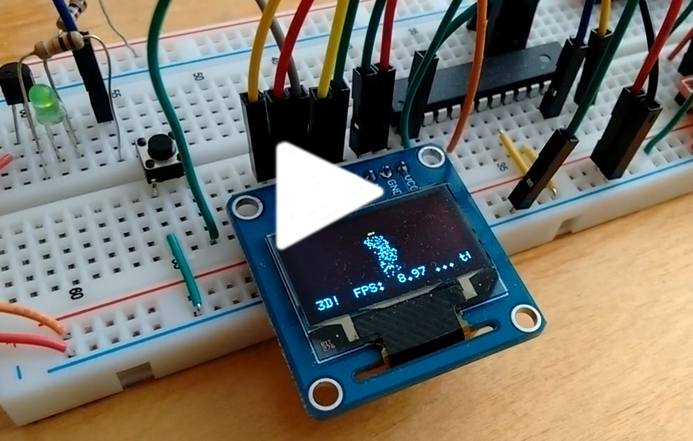
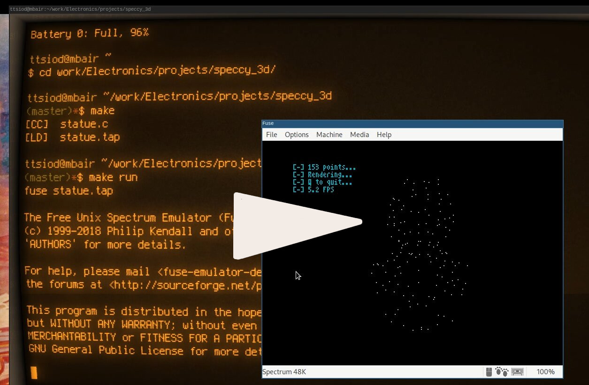
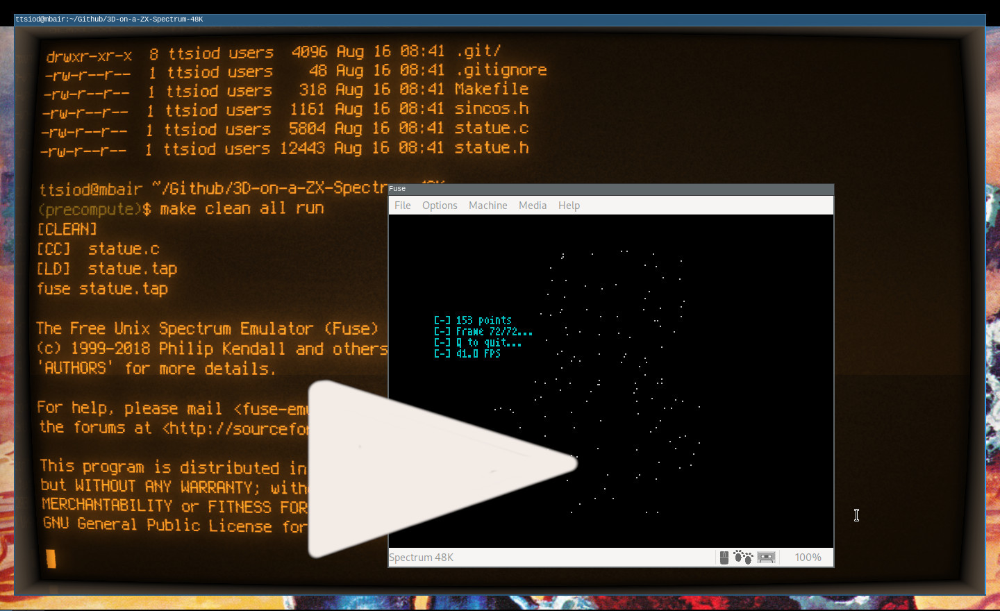
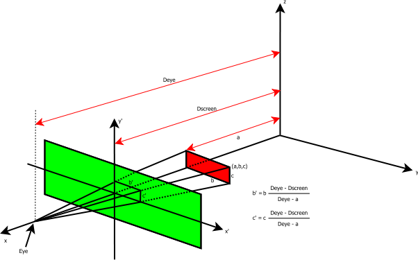

# The backstory

I've been fooling around with SW-only 3D graphics
[for quite some time](https://www.thanassis.space/renderer.html).
A couple of years ago, [I ported the main logic](https://github.com/ttsiodras/3D-on-an-ATmega328p/)
into an ATmega328P microcontroller, implementing "points-only" 3D rendering,
and driving an OLED display via the SPI interface...  at the
magnificent resolution of 128x64 :-)

# The challenge - run it on the Speccy

So the path to even more useless tinkering was clear:

**I had to make this work for my ZX Spectrum 48K! :-)**

And as you can see in this repository... I just did:

There's a simple *Makefile* driving the build process - so once
you have `z88dk` installed, just type:

    make clean all run

The resulting `statue.tap` file is also committed in the repo,
in case you just want to quickly run this in your FUSE emulator.

# Compiling z88dk

The cross-compiler used for the compilation is [z88dk](https://www.z88dk.org/forum/).
If it's not packaged in your distribution, you can easily build it from source:

    mkdir -p ~/Github/
    cd ~/Github/
    git clone https://github.com/z88dk/z88dk/
    cd z88dk
    git submodule init
    git submodule update
    ./build.sh

You can now use the cross compiler - by just setting up your enviroment (e.g. in your `.profile`):

    export PATH=$HOME/Github/z88dk/bin:$PATH
    export ZCCCFG=$HOME/Github/z88dk/lib/config

# On 3D projection and Z80 assembly

Since the Speccy's brain is even tinier than the ATmega328P's, 
I had to take even more liberties:  I changed the computation
loop to orbit the viewpoint (instead of rotating the statue),
thus leading to the simplest possible equations:

    int wxnew = points[i][0]-mcos;
    int x = 128 + ((points[i][1]+msin)/wxnew);
    int y = 96 - (points[i][2]/wxnew);

No multiplications, no shifts; just two divisions, and a 
few additions/subtractions.

--
**UPDATE, May/2026**: I replaced the last two divisions with two multiplications,
using a lookup table of reciprocals (10.6 -> 12.8 FPS).
--

If you're wondering how can this possibly be a valid 3D projection,
you can read the full-of-math "for nerds" section below :-)

But that was not the end - if one is to reminisce, one must go
**all the way**!

So after almost 4 decades, I re-wrote Z80 assembly - and
[made much better use](https://github.com/ttsiodras/3D-on-a-ZX-Spectrum-48K/blob/master/statue.c#L88)
of the Z80 registers [than any C compiler can](https://retrocomputing.stackexchange.com/questions/6095/).

The result?

Almost a 2x speedup... Reaching the phenomenal speed of 12.8 frames per sec :-)

# Pre-calculating for maximum speed

I was also curious about precalculating the entire paths and the
screen memory writes - you can see that code in the
[precompute](https://github.com/ttsiodras/3D-on-a-ZX-Spectrum-48K/tree/precompute)
branch.

As you can see in the video above, this version runs 4 times faster,
at 40 frames per sec. It does take a couple of minutes to precompute
everything, though. Since I had all the time in the world to precompute,
I used the complete equations
([for rotating the statue and 3D projecting](https://github.com/ttsiodras/3D-on-a-ZX-Spectrum-48K/blob/precompute/statue.c#L42))
in 8.8 fixed-point arithmetic:

The reason for the insane speed, is that I precompute the target pixels'
video RAM locations and pixel offsets, leaving almost nothing for the
[final inner loop](https://github.com/ttsiodras/3D-on-a-ZX-Spectrum-48K/blob/precompute/statue.c#L179),
except extracting the memory access coordinates from 16 bits/pixel:

- The offset within the 6K of video RAM, in the upper 13 bits
- The pixel (0-7) within that byte, in the lower 3 bits

It's also worth noting that the
[inline assembly version of the "blitter"](https://github.com/ttsiodras/3D-on-a-ZX-Spectrum-48K/blob/precompute/statue.c#L91)
is 3.5 times faster than [the C version](https://github.com/ttsiodras/3D-on-a-ZX-Spectrum-48K/blob/precompute/statue.c#L175).
Since these are just reads, shifts and writes, I confess I did not expect
to see that much of a difference... But clearly, C compilers for the Z80
[need all the help they can get](https://retrocomputing.stackexchange.com/questions/6095/) :-)

# Next step - the real thing

Now all I need to do is wait for my retirement... so I can use
my electronics knowledge to revive my Speccy, and test this code
on the real thing, not just on the Free Unix Spectrum Emulator :-)

Then again, maybe you, kind reader, can try this out
on your Speccy - and tell me if it works?

Cheers!
Thanassis.

# Addendum: For math nerds - how the projection works

From raw float data to ZX Spectrum screen pixels, every scaling factor explained.

## 1. Source Data

The statue model consists of 153 3D points, stored in `statue_data.py` as
floating-point values. These are processed by `points_gen.py` into a binary blob
(`points.bin`) embedded into Speccy's memory - i.e. "burned" inside the .tap file
and used as-is at runtime. There is some pre-scaling happening, to turn them into
integer values *(pre-scaled by S = 8960)*; simply put, integers are used at
runtime to avoid floating point math on the Z80 - who simply doesn't support it!

### 1.1. Float-to-integer conversion

The scale factor S = 8960 is uniform across all three axes - for example...

    { 0.131,  0.116, -0.501 } x 8960 -> { 1176,  1040, -4485 }

Note that the actual ranges per axis are **asymmetrical**: the model is not centered.

    Axis  |  Float min  |  Int min  |  Float max  |  Int max
    ------+-------------+-----------+-------------+----------
    X     | -0.285      | -2551     | +0.275      | +2460
    Y     | -0.405      | -3630     | +0.373      | +3346
    Z     | -0.501      | -4484     | +0.501      | +4488

## 2. Preprocessing (in the build pipeline)

To maximize runtime performance, the coordinates are in fact pre-transformed
by `points_gen.py` before being embedded in the binary. Let's see how.

### 2.1. Axis swap

  tmp = Y;  Y = Z;  Z = tmp

The storage order becomes [X, Z, Y] instead of [X, Y, Z].  The per-point loop then
computes depth and screen-Y first, and skips computing screen-X for out-of-bounds
points -- a simple optimisation that helps performance a lot with zoomed-in states.

### 2.2. Point coordinates

The coordinates are transformed into a "screen-ready" fixed-point space:

    Component     | Raw formula              | After axis swap
    --------------+--------------------------+--------------------
    X'            | SE - X_raw / 14          | depth axis
    Y'            | Y_raw / 9 * 64           | screen-X axis [2]
    Z'            | Z_raw / 9 * 64           | screen-Y axis [1]

I know, this looks very cryptic :-) Bear with me - and follow along:

With SE = 415 ( 256 + MAXX/16 ), and S = 8960:

    X' = 415 - X_float * 640
    Y' = Y_float * 63795.6
    Z' = Z_float * 63795.6

### 2.3. Sine / cosine (camera orbit)

The sin/cos table is precomputed in `tables_gen.py`. To match the orbit radius 
and maintain 16-bit precision without runtime scaling, we additionally do this:

    sin_val = (sin_raw / 3) * 64
    cos_val = cos_raw / 3

...where the raw values are scaled by T = 256:

    msin = sin(theta) * T * 64 / 3 = sin(theta) * 5461.3
    mcos = cos(theta) * T / 3 = cos(theta) * 85.3

These different scale factors set the camera's orbit radius; tweaking to
match the "orbit" perfectly to the model size.

---

## 3. The Projection Equations inside drawPoints

We end up with the simplest possible projection - no multiplications at
run-time, only two divisions!

    wxnew = X'  - mcos
    y     = 96  - Z' / wxnew
    x     = 128 + (Y' + msin) / wxnew

How? Let's see...

### 3.1. Full derivation in world units

Factor out 640 from the depth term:

    wxnew = X' - mcos
    wxnew = (415 - X_float * 640) - (cos(theta) * 5461.3)
    wxnew = 640 * (415/640 - X_float - cos(theta) * 5461.3/640)
          = 640 * (0.6484 - X_float - cos(theta) * 8.533)

Now, if we divide all numerators and denominators in the projection division by 640...

    y = 96  - Z' / wxnew
    x = 128 + (Y' + msin) / wxnew

...the equations become:

                                Z_float * 99.68
     y_screen = 96 - -------------------------------------------
                       0.6484 - X_float - cos(theta) * 8.533

                        Y_float * 99.68 + sin(theta) * 8.533
    x_screen = 128 + ---------------------------------------------
                       0.6484 - X_float - cos(theta) * 8.533

If we define depth as the positive distance:

    depth = X_float + d * cos(theta) - d0

...and...

    f  ~ 99.68 px        focal length       = S / 90
    d  ~  8.53 units     orbit radius       = T * 64 / (3 * 640)
    d0 ~  0.65 units     SE offset          = 415 / 640

...then the full projection equations become:

                      f * Z
    y_screen = 96 - ---------
                      depth

                      f * Y + d * sin(theta)
    x_screen = 128 + ------------------------
                              depth

It becomes clear now that these are the standard 3D projection equations;
*(see the diagram above!)* - with the `d*sin(theta)` offseting our camera's
viewpoint by the rotation we apply.

### 3.2. What each parameter means

    Parameter    | Value       | Derivation                    | Role
    -------------+-------------+-------------------------------+----------------------------
    f            | 99.68 px    | S * 64/9 / 640 = S / 90       | Focal length, controls proj size
    d            |  8.53 units | T * 64/3 / 640 = 256/30       | Camera orbit radius
    d0           |  0.65 units | SE / 640 = 415 / 640          | Keeps model in front of camera
    Screen centre| (128, 96)   | -                             | Half of 256 x 192
    View dir     | +X          | -                             | Camera looks along +X axis

## 4. Camera Model

The camera goes around on a circle - around a point at a specific distance from the model.

    camera_X(theta) = d * cos(theta) - d0 = 8.53 * cos(theta) - 0.65

### 4.1. Why SE = 415?

  SE = 256 + MAXX / 16 = 256 + 2551 / 16 = 256 + 159 = 415

    256      screen width, centres the model horizontally
    MAXX/16  accounts for the X-range after preprocessing

Without SE,  X' = -X_float * 640  could be negative for positive X, flipping the
division sign and putting the model behind the camera.  SE adds a constant offset
so X' stays positive and  depth > 0  for all model points.

---

## 5. Summary: The Full Pipeline

    Float data {X, Y, Z} in `statue_data.py`
           |
           |  Build Pipeline (`points_gen.py` & `tables_gen.py`)
           v
    Pre-transformed coordinates in `points.bin`
    (Scale S=8960, Axis swap, and Screen-space transform applied)
           |
           |  Runtime Loop
           v
    X' = Precomputed depth axis
    Y' = Precomputed screen-X axis (stored at [2])
    Z' = Precomputed screen-Y axis (stored at [1])
  
    msin = Precomputed sin(theta) transform
    mcos = Precomputed cos(theta) transform
  
           |
           |  For each frame
           v
  
    wxnew = X' - mcos         (depth from camera)
    y = 96  - Z' / wxnew      (perspective -> vertical)
  
           |
           |  If 0 <= y < 192:
           v

    x = 128 + (Y' + msin) / wxnew  (perspective -> horizontal)

    byte_addr = ofs[y] + (x >> 3)  (done via scr_ofs lookup table)
    bit_mask  = 128 >> (x & 7)     (done via mask lookup table
    set bit in byte

Note that in the ASM version, the final two divisions are replaced with two
multiplications with the divider reciprocal. Speedup: 6% :-)
